# Essential Workers
The Essentials Workers webpage provides an overview of data regarding essential workers across Missouri and Illinois. The page features an interactive map and static table. The interactive map represents one of three geographies (Missouri, Illinois, or Saint Louis) and five measures (Gross Domestic Profit, Labor Force, Unemployment Rate, Median Income, and Frontline Rate). The table features a demographic breakdown of data relating to each of the aforementioned geographies by "Frontline Industry" (such as *Health Care*, *Public Transit*, and *Grocery, Convenience, and Drug Stores*).

## Data and ETL
The webpage uses data collected from the United States Census Bureau and the U.S. Bureau of Economic Analysis (BEA). Python and R were used to perform ETL operations on the data before use on the webpage. This repository features an abridged version of the code base and therefore does not feature the scripts used for the ETL process, refer to the original repository to view said scripts: https://github.com/stlrda/essential-workers

## Key Technology (Front End)
The responsive webpage was developed using the React.js library and utilizes CSS frameworks such as Material UI, mdbbootstrap, and Mapbox.GL.

## Demonstration (Animated)

### Map
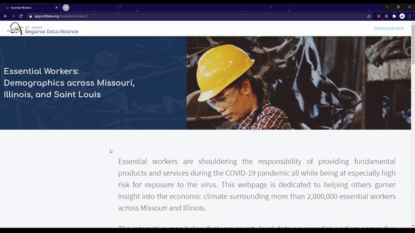

### Table
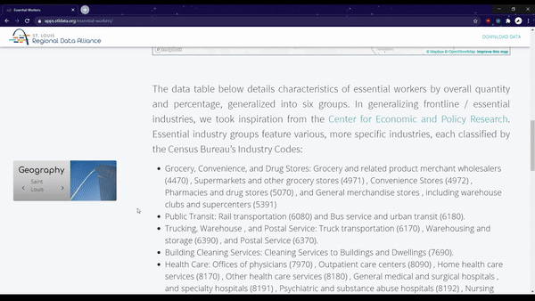

### Responsiveness Preview

## Demonstration (Still Images)

### Hero Image
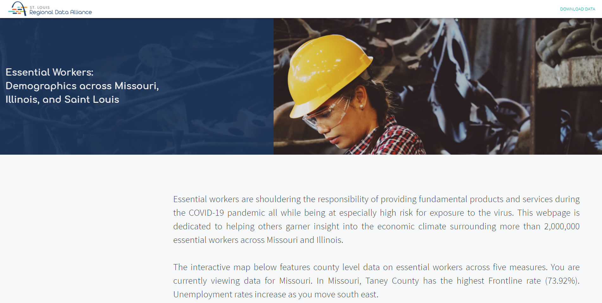

### Map View (Missouri - Unemployment Rate)
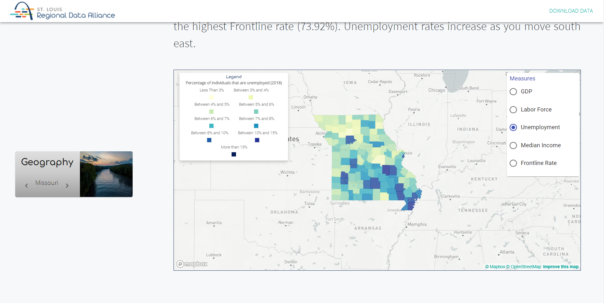

### Map View (Illinous - Unemployment Rate)
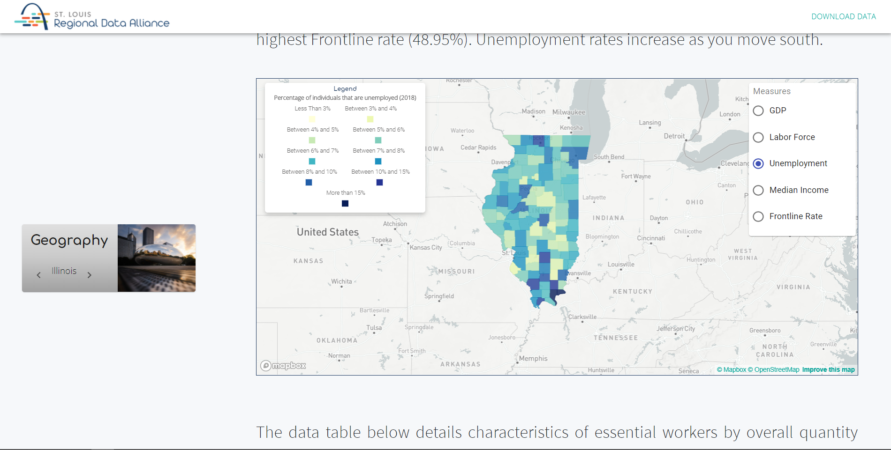

### Map View (Saint Louis - Median Income)
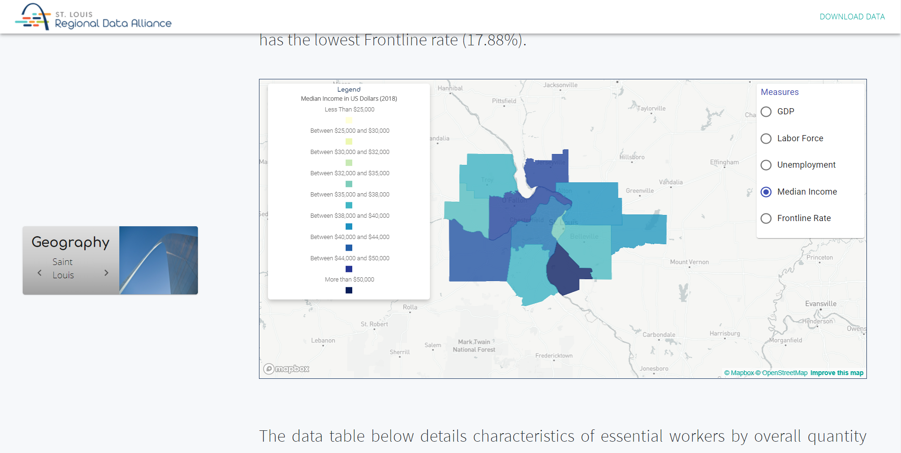

### Table (Saint Louis)
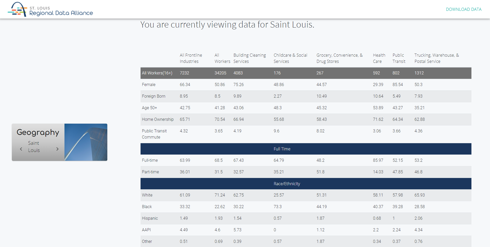

### Table (Missouri)
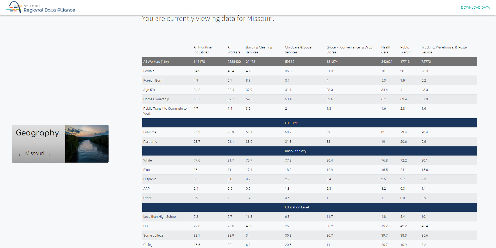

### Table (Illinois)
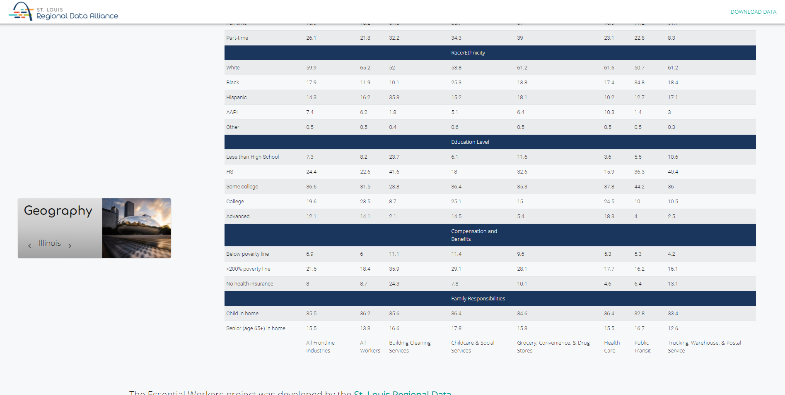

### Credits / Footer
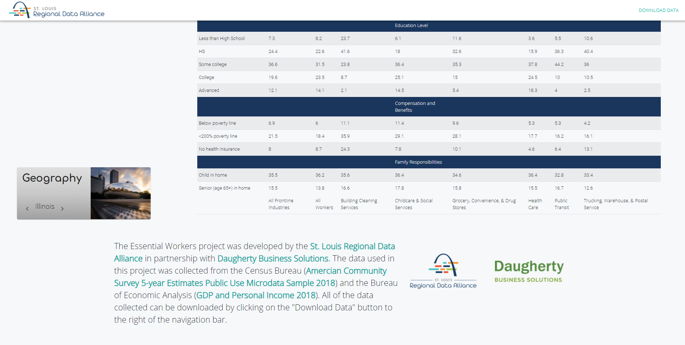

### Mobile Preview
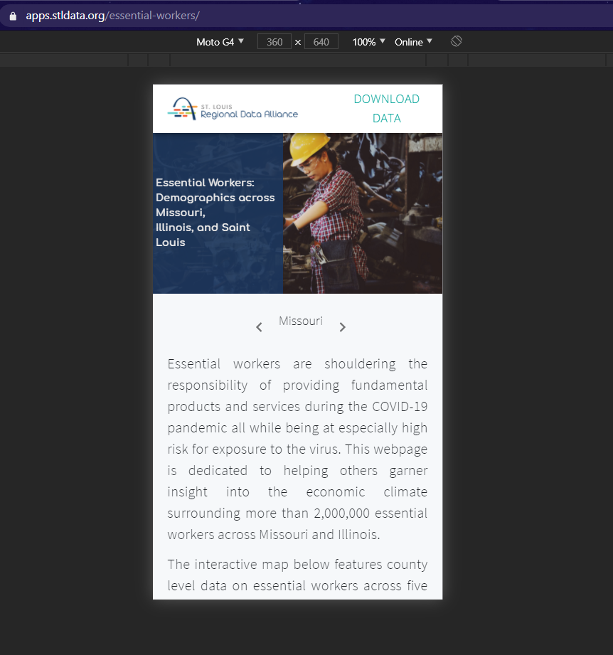

